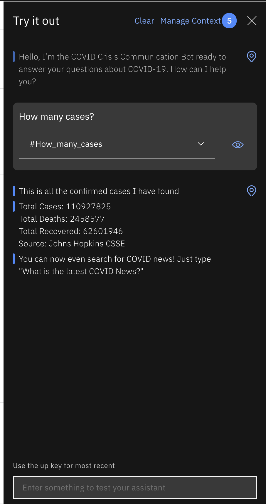

In times of crisis, chatbots can help people quickly find answers they need to critical questions. In the case of a pandemic like COVID-19, people might be trying to find basic information about testing, symptoms, community response, and other resources.

This tutorial shows you how to create a crisis communication chatbot using IBM&reg; Watson&trade; Assistant and how to add webhooks to Watson Assistant to query for dynamic data using Watson Discovery and COVID-19 APIs.

### Learning objectives

In this tutorial, you will:

* Provision an instance of Watson Assistant
* Add a dialog skill to your Watson Assistant instance
* Connect your Watson Assistant with Watson Discovery
* Create Cloud Functions
* Integrate data sources via a Watson Assistant webhook

### Prerequisite

Register for an [IBM Cloud](https://cloud.ibm.com/registration?cm_mmc=Inpersondirected-_-Audience+Developer_Developer+Conversation-_-WW_WW-_-Feb2021-enhanceyourcrisiscommunicationchatbotwiththecovid-19apinewssources-eventid-600ecf8498b62becb49bfeea-global-devadvgrp-dubai-hybrid-workshop-dubai_ov75915&cm_mmca1=000039JL&cm_mmca2=10010797&eventid=600ecf8498b62becb49bfeea) account.

### Estimated time

This tutorial takes about 40 minutes to complete.

## Create your chatbot by setting up a Watson Assistant instance

We show you how to create a chatbot using Watson Assistant, a tool that enables you to build conversational interfaces into any application, device, or channel.

1. In the [IBM Cloud catalog](https://cloud.ibm.com/catalog/services/watson-assistant), navigate to the Services and provision an instance of **Watson Assistant**.

    

1. Launch the Watson Assistant service.

1. Click **Create assistant** and follow these [detailed instructions](https://cloud.ibm.com/docs/assistant?topic=assistant-assistant-add) for how to create an assistant.

    

1. Name the Watson Assistance instance **COVID Crisis Communication**.

    

1. Click **Add dialog skill** to the assistant. [Follow the documentation](https://cloud.ibm.com/docs/assistant?topic=assistant-skill-dialog-add) if you have questions.

    
*
1. Click **Import Skill > Choose JSON file** and import the [`Covid Json`](https://github.com/Call-for-Code/Solution-Starter-Kit-Communication-2020/blob/master/starter-kit/assistant/skill-CDC-COVID-FAQ.json) file.

    

1. Go back to All Assistants page. From the action menu ( **`⋮`** ), open **Settings**.

    

1. On the Settings tab, click **API Details** on the left and make a note of the `Assistant ID` and `API Key` for future use.

    

1. Go back to the All Assistants page and click on the **Skills** link.

    

1. On the Skill page, click on the action menu ( ⋮ ) and open **View API Details**.

    

1. On the Skill Details page, make note of the Skill ID for future use.

    

1. Go back to your dialog skill and click on the **Preview Link** button on the side to get a link to test and verify your assistant.

    

1. Ask the Watson Assistant chatbot some questions about COVID-19.

    

## Integrate your chatbot with data sources

Now that you've created your Watson Assistant-enabled chatbot, you need to connect it to a data source. The following section shows you how to do that by adding webhooks to Watson Assistant that query for dynamic data.

Our crisis communication chatbot uses three different data sources:

- [Watson Discovery](https://www.ibm.com/cloud/watson-discovery)
- [COVID-19 API](https://covid19api.com/)
- [Weather Company data](https://weather.com/coronavirus/l/35.7358,-78.8955)

### Defining webhooks

First, let's look at what webhooks do. A *webhook* is a mechanism that allows you to call out to an external program based on something happening in your program. When used in a dialog skill, a webhook is triggered when the assistant processes a node that has a webhook enabled. The webhook collects data that you specify or that you collect from the user during the conversation and saves in context variables.

It sends the data as part of a HTTP POST request to the URL that you specify as part of your webhook definition. The URL that receives the webhook is the listener. It performs a predefined action using the information that you pass to it as specified in the webhook definition, and can optionally return a response.

### Make use of Watson Discovery to get news information

1. From your IBM Cloud account, go to Watson Discovery.

    

2. Create a new lite service by clicking **Create**.

    

3. Make note of the API key and the URL. You need that in the next steps.

    

4. Open the Watson Discovery NEWS service, which is a prepopulated discovery dataset updated and maintained by the Watson Discovery team.

    

5. From the top right corner, open the API tab. Make note of the Collection ID and Environment ID.

    

### Get a Weather Company API key

You need an API key to use The Weather Company API for COVID-19 Disease Tracking. [Call for Code](https://developer.ibm.com/callforcode/) participants can read the Terms of Service and register to join the [Call for Code 2020 COVID Challenge](https://developer.ibm.com/callforcode/get-started/covid-19/) and request a TWC API key.

1. Go to [https://callforcode.weather.com/register/](https://callforcode.weather.com/register/)

2. Sign up for an API key with your information. Your API key will be emailed to you.

3. Save the API key for future use.

### Create Cloud Functions

1. In the IBM Cloud catalog, go to [IBM Cloud Functions](https://cloud.ibm.com/functions/?cm_sp=ibmdev-_-developer-tutorials-_-cloudreg).

1. Click **Start Creating**.

    

1. Select **Create Action**.

    

1. Name your action. For the Runtime dropdown, select **Node.js 10**.

    

1. Replace the code with [data/covid-webhook.js](https://github.com/Call-for-Code/Solution-Starter-Kit-Communication-2020/blob/master/starter-kit/webhook/action/covid-webhook.js)

    

1. Our code has two main parts. We decide whether to call the COVID-19 API or Watson Discovery based on a parameter sent on the function call. If a query param of `type=api` is set, you call the COVID-19 api on the [summary endpoint](https://api.covid19api.com/summary).

    It returns the data in the following format:

    ```
    {
      Countries: [
        {
          Country: "",
          Slug: "",
          NewConfirmed: 0,
          TotalConfirmed: 0,
          NewDeaths: 0,
          TotalDeaths: 0,
          NewRecovered: 0,
          TotalRecovered: 0
        },
        {
          Country: " Azerbaijan",
          Slug: "-azerbaijan",
          NewConfirmed: 0,
          TotalConfirmed: 0,
          NewDeaths: 0,
          TotalDeaths: 0,
          NewRecovered: 0,
          TotalRecovered: 0
        },
        ...
      ]
    }
    ```

1. If there is specific location (Country/Country Code/US State) selected, you look for that location either using The Weather Company API or in the summary response and return the status for that location.

    For example, the response for `type=api` and `location=United States of America` is shown below.

    ```
    {
      "result": "Total Cases: 65778\nTotal Deaths: 942\nTotal Recovered: 361\n\nSource: Johns Hopkins CSSE"
    }
    ```

1. If you want to make a call to the Discovery service, you need to set some parameters that let you call the IAM-enabled service. On the left, click on the **Parameters** tab. Add the following parameters:

    - `api_key`(Discovery API key)
    - `twcApiKey` (API key from The Weather Company)
    - `url` (URL to your Discovery service instance)
    - `collection_id`
    - `env_id`

    

1. Enable the action as a web action. To do so, select the **Endpoints** tab on the left. Click the checkbox beside **Enable as Web Action.**

    

1. Make note of the HTTP URL. You will use this as the webhook for your assistant. You will have to add `.json` in the end of this URL to make it work as a webhook.

    

### Integrate data sources via a Watson Assistant webhook

For detailed instructions on how to integrate data sources via a webhook, check out our documentation: [Making Programmatic Calls from Watson Assistant](https://cloud.ibm.com/docs/assistant?topic=assistant-dialog-webhooks).

Here are the specific steps to add a webhook to your COVID-19 chatbot.

1. Bring up the COVID-19 assistant you created earlier. Find it in your IBM Cloud account under Services > IBM Watson Assistant. Open the dialog by clicking the `CDC COVID FAQ` Dialog.

    

1. Click on **Options** on the left.

    

1. Under Options > Webhooks, in the URL text box, paste the URL from the Cloud Funciton step. Make sure to add a `.json` at the end of the URL.

    

1. Select **Dialog** on the left navigation.

    

1. Open up any dialog node you want to add a webhook call for.

1. After selecting the node, click **Customize**.

    

1. Enable your webhooks by moving the toggle button to **On** in the Webhooks section. Click **Save**.

    

1. Add any parameter your webhook needs. These will be sent as query parameters.

    

1. Test that your webhook integration is working by going to the **Try It** tab and initiating a dialog that calls the webhook.

    

You can easily use webhooks to give your Watson Assistant access to many external APIs and databases.

## Next steps

Now that you know how to create a COVID-19 chatbot and connect it to Watson Discovery and the COVID-19 API, there are a few different integration paths you can take. The following tutorials show you how to integrate this chatbot with Slack, with a simple web application, or with a Node-RED dashboard.

* [Embed your COVID-19 chatbot on a website](https://developer.ibm.com/tutorials/tutorials/create-a-covid-19-chatbot-embedded-on-a-website/)
* [Integrate your COVID-19 chatbot with Slack](https://developer.ibm.com/tutorials/create-crisis-communication-chatbot-integrate-slack/)
* [Integrate your COVID-19 chatbot with Node-RED to enable voice commands](https://developer.ibm.com/tutorials/create-a-voice-enabled-covid-19-chatbot-using-node-red/)